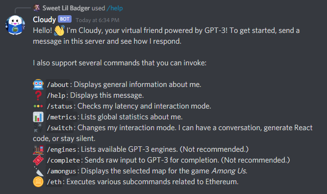

# Cloudy - The Hacker's Assistant

Cloudy is a friendly Discord bot, designed to help out Discord servers full of
indie hackers. Cloudy has various talents depending on the situation:

* **Lonely or looking to share ideas?** You can chat with Cloudy! He's trained
  to be both friendly and helpful. He will also remember the conversation.
  (Cloudy's AI is backed by [GPT-3][gpt], so you may be pleasantly surprised by
  his intelligence!)
* **Don't want to code?** All you need to do is describe the UI you'd like to
  build. Cloudy will do the heavy lifting and generate the React component for you.
* **Feeling social?** Grab some friends and play [Among Us][]! Cloudy will fetch
  the maps for you. You'll never get lost or stabbed again!

### Try out the live bot by visiting [this link][invite link].

_Imagine an embedded demo video here..._

_Cloudy was proudly built on [repl.it][] using the [OpenAI API][] and
[discord.py][]. You can view the [REPL][repl] or browse the [source code][gh].
Follow [liuandrewk][twitter] on Twitter if you have any questions or feedback._

## User Guide & Features

Below are some features of what Cloudy can do.

### Getting Started

* invite discord bot to your server
* type stuff
* use `/switch` to change interaction mode and `/help` for more details

### AI chat

* it'll use GPT-3 to be a chat bot
* use `/switch` to use chat mode; though this is the default
* there is some semblance of memory here
* it can chat with you or answer questions; the world's your oyster

### Code Generator

* also uses GPT-3
* just `/switch` to change it to code mode
* describe the UI you want and it'll spit out react code

### Among Us Maps

* this is a slash command `/amongus`
* you can pick from 4 maps
* that's about it, but it's remarkably helpful

### ...and more!

* use `/about` and `/help` when in doubt
* `/metrics` for global stats
* `/switch` to change modes or silence the bot
* other fun easter eggs

## Developer Guide

### having a local running bot

* fork this repl
* make a discord app and discord bot account
* and set the account permissions and whatnot
* get the token and set it as your env
* get an openAI API key (optional)
* run the bot
* turn on `Always On` instead of doing that keep_alive bs

### how to operate GPT-3 under the hood

* create a "warmup" history to "train" the bot
* if you have memory, append to the history
* for slash commands, we use an extension library

[invite link]: https://discord.com/oauth2/authorize?client_id=847843661973684224&permissions=18496&scope=bot%20applications.commands
[Among Us]: https://en.wikipedia.org/wiki/Among_Us
[gpt]: https://openai.com/blog/gpt-3-apps/
[repl.it]: https://replit.com/
[OpenAI API]: https://beta.openai.com/
[discord.py]: https://discordpy.readthedocs.io/en/stable/
[gh]: https://github.com/MrPickles/Cloudy-the-Discord-Bot
[repl]: https://replit.com/@liuandrewk/Cloudy-The-Hackers-Assistant
[twitter]: https://twitter.com/liuandrewk