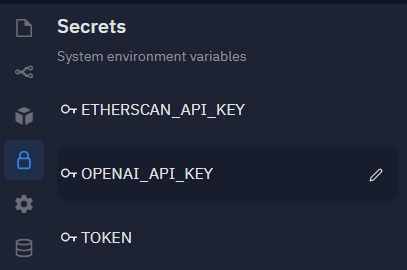

# Cloudy - The Hacker's Assistant

Cloudy is a friendly Discord bot, designed to help out Discord servers full of
indie hackers. Cloudy has various talents depending on the situation:

* **Lonely or looking to share ideas?** You can chat with Cloudy! He's trained
  to be both friendly and helpful. He will also remember the conversation.
  (Cloudy's AI is backed by [GPT-3][gpt], so you may be pleasantly surprised by
  his intelligence!)
* **Don't want to code?** All you need to do is describe the UI you'd like to
  build. Cloudy will do the heavy lifting and generate the React component for you.
* **Feeling social?** Grab some friends and play [Among Us][]! Cloudy will fetch
  the maps for you. You'll never get lost or stabbed again!

### You can try out the live bot by visiting [this link][invite link].

_Imagine an embedded demo video here..._

_Cloudy was proudly built on [Replit][replit] using the [OpenAI API][] and
[discord.py][]. You can view the [REPL][repl] or browse the [source code][gh].
Follow [@liuandrewk][twitter] on Twitter if you have any questions or feedback._

## User Guide & Features

Below are some features of what Cloudy can do.

### Getting Started

* invite discord bot to your server
* type stuff
* use `/switch` to change interaction mode and `/help` for more details

### AI chat

* it'll use GPT-3 to be a chat bot
* use `/switch` to use chat mode; though this is the default
* there is some semblance of memory here
* it can chat with you or answer questions; the world's your oyster

### Code Generator

* also uses GPT-3
* just `/switch` to change it to code mode
* describe the UI you want and it'll spit out react code

### Among Us Maps

* this is a slash command `/amongus`
* you can pick from 4 maps
* that's about it, but it's remarkably helpful

### ...and more!

* use `/about` and `/help` when in doubt
* `/metrics` for global stats
* `/switch` to change modes or silence the bot
* other fun easter eggs

## Developer Guide

Looking to develop with Cloudy? Awesome! We'll cover some basics to get you
started and talk about how everything works under the hood.

### Running a Local Instance of Cloudy

In this section we'll go over the steps to run your own instance of Cloudy.

1. [Fork this REPL.][repl] This repository uses the [Replit Database][replit db]
   as a hard dependency, so I recommend working within [Replit][replit].
1. Create a Discord Bot Account. The [starter docs from discord.py][app docs] are
   really good, so I recommend following those. Be sure to gather your **bot
   token** and **OAuth2 invitation URL**.

   * Your application will  need the following OAuth2 scopes:
     * `bot`
     * `applications.command`

   * Additionally, you'll need to set the following bot permissions:
     * `Send Messages`
     * `Embed Links`
     * `Add Reactions`

1. (optional) Visit the [OpenAI API][] website can claim an API key. You may be
   subjected to a waitlist, so this step is optional. However, expect the bot to
   have degraded performance without the API key.
1. Set the bot token and OpenAI API key in your Replit environment. Set them as
   `TOKEN` and `OPENAI_API_KEY`, respectively.

   

1. Run the code. Be sure to enable the `Always On` feature in your REPL so your
   bot won't shut down after periods of inactivity.

   

1. Add the your bot to your Discord server via your OAuth2 invitation link.

### Operating GPT-3 from the Application Layer

At its core, GPT-3 is a text completion engine. It is up to the developer to
"train" it with "warmup" text so its output will be something desireable. Thus
you might notice that a fair amount of Cloudy's internal logic revolves around
keeping a history of chat interactions. It will feed previous interactions to
GPT-3 in order to infer the next response.

You have many options with GPT-3 if you're creative with the input it receives.

### Slash commands

Most chat bot features occur as a result of normal conversations happening
within a Discord server. However, Cloudy also supports slash commands. We use an
[extension library][discord-py-slash-command] to support those commands. As a
result, it gives us benefits such as fuzzy autocompletion and enumerated
arguments. Any non-chat commands you add should be a slash command.

---

_Thanks for reading! Once again, you can try out Cloudy by visiting
[this link][invite link]. Please reach out to [@liuandrewk][twitter] with
questions and feedback._

[invite link]: https://discord.com/oauth2/authorize?client_id=847843661973684224&permissions=18496&scope=bot%20applications.commands
[Among Us]: https://en.wikipedia.org/wiki/Among_Us
[gpt]: https://openai.com/blog/gpt-3-apps/
[replit]: https://replit.com/
[OpenAI API]: https://beta.openai.com/
[discord.py]: https://discordpy.readthedocs.io/en/stable/
[gh]: https://github.com/MrPickles/Cloudy-the-Discord-Bot
[repl]: https://replit.com/@liuandrewk/Cloudy-The-Hackers-Assistant
[twitter]: https://twitter.com/liuandrewk
[replit db]: https://docs.replit.com/misc/database
[app docs]: https://discordpy.readthedocs.io/en/stable/discord.html#discord-intro
[discord-py-slash-command]: https://discord-py-slash-command.readthedocs.io/en/latest/index.html