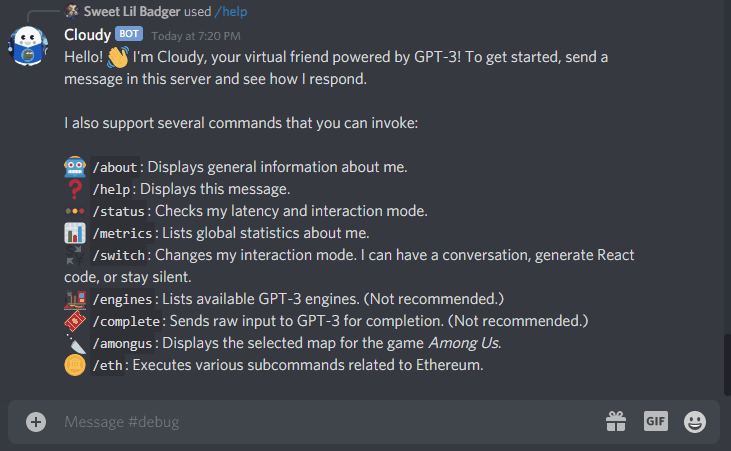

# Cloudy - The Hacker's Assistant

Cloudy is a friendly Discord bot, designed to help out Discord servers full of
indie hackers. Cloudy has various talents depending on the situation:

* **Lonely or looking to share ideas?** You can chat with Cloudy! He's trained
  to be friendly, helpful, and have good memory. (Cloudy's AI is backed by
  [GPT-3][gpt], so you may be pleasantly surprised by his intelligence!)
* **Don't want to code?** All you need to do is describe the UI you'd like to
  build. Cloudy will do the heavy lifting and generate the React component for you.
* **Feeling social?** Grab some friends and play [Among Us][]! Cloudy will fetch
  the maps for you. You'll never get lost or stabbed again!
* **Interested in Crypto?** Cloudy will get you real time data on Ethereum. Now
  you can stop spamming refresh on your Coinbase tab!

### Try out the live bot by visiting [this link][invite link]. Also be sure to check out the [Demo Video][loom].

[][loom]

_Cloudy was proudly built on [Replit][replit] using the [OpenAI API][],
[Etherscan API][], and [discord.py][]. You can view the [REPL][repl] or browse
the [source code][gh]. Follow [@liuandrewk][twitter] on Twitter if you have any
questions or feedback._

## Getting Started

Getting started is simple. Here's what you do:

1. [Invite Cloudy][invite link] to your Discord Server.
2. Start talking!

That's all you need to do. Additionally, Cloudy will expose several Discord
commands. We will discuss all of them in more detail in the next section. As an
example, here are _some of them_ to whet your appetite:

* `/amongus` fetches the maps in _Among Us_.
* `/switch` allows you to change the bot's interaction mode.
* `/eth price` shows the current Ethereum price.
* `/help` will list out all other commands and a getting started guide.

We will discuss the remaining commands and features next. Onwards!

## User Guide & Features

Cloudy has lots of cool features for Discord users. We will discuss each of them
in stride.

### Conversational AI Chat 

Cloud has a conversational chat AI powered by [GPT-3][gpt]. It will respond to
whatever you say in the Discord server and can remember your conversation.

You can have a surprisingly realistic chat with Cloudy. If you're in a curious
mood, feel free to throw some questions at Cloudy. The AI has historical
knowledge, so you should receive factual answers.

By default Cloudy should be in conversational mode. You can always use the
`/switch` command to toggle between chat modes or silence the bot.

Note that Cloudy will not pay attention to new messages while he is thinking
about a response. This is to prevent chat spamming from users.

### React Code Generation

Aside from normal conversations, you can have Cloudy generate React code by
describing a UI. To enable this, use the `/switch` command to toggle the bot's
interaction mode. Now you're all set! Describe a UI in the Discord server, and
Cloudy should respond with its source code.

You _must_ set the interaction mode first, or else Cloudy will have a normal
conversation. When in doubt, you can always use the `/status` command to get
Cloudy's current interaction mode.

Note that conversational chat is disabled during code generation mode (and vice
versa).

### Among Us Maps

Cloudy exposes the `/amongus` command to fetch maps in _Among Us_. It takes in
one parameter, which is the map name. You do not have to type in the full map
name (or memorize the names), as Cloudy knows the maps and will allow you to
autocomplete the name.

The bot will then render a high-quality image of the chosen map with pointers
about various details about map. I recommend running this command while you're
in a lobby of _Among Us_. That way you can have the map up before a game begins.

Currently there are four maps in the game.

* The Skeld
* MIRA HQ
* Polus
* The Airship

Please [ping me][twitter] if there's an update and you would like the new map
added.

### Ethereum Utilities

To check up on information related to Ethereum, you can use Cloudy's `/eth`
command group. The command group exposes two subcommands:

* `/eth price` checks the current Ethereum price.
* `/eth balance <wallet>` checks an Ethereum wallet's balance.

The `price` subcommand takes no arguments and gets the current value of Ethereum
and Bitcoin in USD. Since their prices can fluctuate, we also include the last
time that this price was checked.

The `balance` subcommand takes in an Ethereum wallet address and checks the
amount of Ether within the wallet. It also converts the Ether to its current
value in USD.

### And More!

There are several more commands to help you leverage Cloudy. You can view them
all using the `/help` command.

I can provide additional context for some of these commands:

* `/switch` changes Cloudy's interaction mode. It takes in one parameter, which
  is the desired mode. The mode can either be for conversational AI, code
  generation, or silent mode. Like with other commands, there's autocompletion.
* `/status` will show Cloudy's state, which includes details like latency,
  current interaction mode, and build time. This is a great way to debug Cloudy
  in case of unusual behavior.
* `/metrics` fetches global stats about Cloudy. These include number of Discord
  servers joined, number of GPT-3 completions generated, and number of Etherscan
  API calls made.
* `/engines` lists out the available GPT-3 engines. This is mainly for debugging
  purposes. (However, it _can_ check whether Cloudy can connect to OpenAI.)
* `/complete <prompt>` feeds in raw input for GPT-3 completion. It takes in a single
  parameter, which is the raw input text. This is also mainly for debugging
  purposes, though it might be cool to see how things work behind the scenes.

Lastly, I want to you to know that **there are easter eggs hidden throughout the
bot**. I have not described any of them in this README. This is in order to
incentize you to check out the [REPL][repl] and interact with the
[live bot][invite link]. Have fun! 🙊

## Developer Guide

Looking to develop with Cloudy? Awesome! We'll cover some basics to get you
started and talk about how everything works under the hood.

### Running a Local Instance of Cloudy

In this section we'll go over the steps to run your own instance of Cloudy.

1. [Fork this REPL.][repl] This repository uses the [Replit Database][replit db]
   as a hard dependency, so I recommend working within [Replit][replit].
1. Create a Discord Bot Account. The [starter docs from discord.py][app docs] are
   really good, so I recommend following those. Be sure to gather your **bot
   token** and **OAuth2 invitation URL**.

   * Your application requires the following OAuth2 scopes:
     * `bot`
     * `applications.command`

   * Additionally, you'll need to set the following bot permissions:
     * `Send Messages`
     * `Embed Links`
     * `Add Reactions`

1. (optional) Visit the [OpenAI API][] website can claim an API key. You may be
   subjected to a waitlist, so I've made the API a soft dependency. However,
   expect to have degraded performance without API access.
1. Make an account on [Etherscan][Etherscan API] and and generate an API key.
   Although they have a premium API, the free tier is sufficient.
1. Set the bot token, OpenAI API key, and Etherscan API key in your Replit
   environment. Give them the respective variable names:

   * `TOKEN`
   * `OPENAI_API_KEY`
   * `ETHERSCAN_API_KEY`

   

1. Run the code. Be sure to enable the `Always On` feature in your REPL so your
   bot won't shut down after periods of inactivity.

   

1. Add the your bot to your Discord server via your OAuth2 invitation link.

### Operating GPT-3 from the Application Layer

At its core, GPT-3 is a text completion engine. It is up to the developer to
"train" it with "warmup" text so its output will be something desireable. Thus
you might notice that a fair amount of Cloudy's internal logic revolves around
keeping a history of chat interactions. It will feed previous interactions to
GPT-3 in order to infer the next response.

You have many options with GPT-3 if you're creative with the input it receives.

### Slash commands

Most chat bot features occur as a result of normal conversations happening
within a Discord server. However, Cloudy also supports [slash commands]. We use
an [extension library][discord-py-slash-command] to support those commands. As
a result, it gives us benefits such as fuzzy autocompletion and enumerated
arguments. Any non-chat commands you add should be a slash command.

---

_Thanks for reading! Once again, you can try out Cloudy by visiting
[this link][invite link]. Please reach out to [@liuandrewk][twitter] with
questions, comments, or feedback. I'd love to hear from you._

[invite link]: https://discord.com/oauth2/authorize?client_id=847843661973684224&permissions=18496&scope=bot%20applications.commands
[Among Us]: https://en.wikipedia.org/wiki/Among_Us
[gpt]: https://openai.com/blog/gpt-3-apps/
[replit]: https://replit.com/
[OpenAI API]: https://beta.openai.com/
[Etherscan API]: https://etherscan.io/apis
[discord.py]: https://discordpy.readthedocs.io/en/stable/
[gh]: https://github.com/MrPickles/Cloudy-the-Discord-Bot
[repl]: https://replit.com/@liuandrewk/Cloudy-The-Hackers-Assistant
[twitter]: https://twitter.com/liuandrewk
[replit db]: https://docs.replit.com/misc/database
[app docs]: https://discordpy.readthedocs.io/en/stable/discord.html#discord-intro
[discord-py-slash-command]: https://discord-py-slash-command.readthedocs.io/en/latest/index.html
[slash commands]: https://www.youtube.com/watch?v=4XxcpBxSCiU
[loom]: https://www.loom.com/share/25d612c2625c4321a899a14e30b868d9